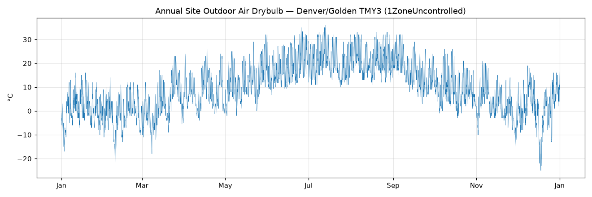

# EnergyPlus Online Plotter

A live, TRNSYS-style **online plotter** for EnergyPlus: it drives a simulation and plots its
output as time-series charts **in real time while the run is in progress** — so you can watch a
model unfold, sanity-check it early, and kill a bad run instead of waiting for it to finish.

EnergyPlus doesn't reliably flush its output files mid-run, so this tool doesn't tail
`eplusout.csv`. Instead it drives the run through the **EnergyPlus Runtime API** (`pyenergyplus`)
and reads each variable directly from the simulation every timestep.

## Features

- **Live streaming** of a running EnergyPlus simulation to an interactive plot.
- Plots the variables your model already declares as **`Output:Variable`**; `*` keys are expanded
  to one curve per component (e.g. one per zone or surface).
- **Independent left / right Y-axes** and per-variable **show/hide** — compare quantities with very
  different units (temperatures vs. heating/cooling loads).
- **Run controls**: pause, resume, and abort the simulation from the window.
- **Zoom / pan** over real simulation date-time, with a "Reset view" to full extent.
- **Bounded memory + downsampling** so a full annual run stays smooth.
- Skips **warmup** and **sizing design days** by default, so the plot is the real run from the
  first timestep.

## Example

Annual outdoor dry-bulb temperature streamed from a run on the Denver/Golden TMY3 weather file —
the streamed values match the weather file's own dry-bulb column exactly (min −25, max 36,
mean 9.76 °C):



## Requirements

- **Windows** with **EnergyPlus 25.2** installed (e.g. `C:\EnergyPlusV25-2-0`). The tool finds the
  newest install automatically; override with `--eplus-root`.
- [**uv**](https://docs.astral.sh/uv/) for environment management (Python 3.13).

> EnergyPlus versions older than 25.2 lack the `stop_simulation` API and are not supported.

## Install

```sh
git clone https://github.com/yiyuan-jia/EnergyPlus-online-plotter.git
cd EnergyPlus-online-plotter
uv sync --extra ui          # runtime + GUI deps (add --extra dev for tests/type-checking)
```

## Usage

```sh
uv run eplus-plotter run <model.idf> -w <weather.epw> [options]
```

Example — stream one zone temperature plus the building's heating and cooling load:

```sh
uv run eplus-plotter run model.idf -w weather.epw \
  --var "Zone Mean Air Temperature" \
  --var "Zone Air System Sensible Heating Rate" \
  --var "Zone Air System Sensible Cooling Rate" \
  --throttle 0.02
```

| Option | Description |
|---|---|
| `-w, --weather PATH` | EPW weather file (required) |
| `-d, --outdir DIR` | EnergyPlus output directory (default `eplus-out`) |
| `--var NAME` | Only stream the named `Output:Variable`(s); repeatable. Default: all declared |
| `--throttle SECONDS` | Sleep per timestep to slow a fast sim down so you can watch it |
| `--include-sizing` | Also run/plot the sizing design days (default: skipped via EnergyPlus `--annual`) |
| `--eplus-root PATH` | Use a specific EnergyPlus install |

In the window, the right-hand panel lists every streamed variable with a **show** checkbox and an
**L/R** axis selector; the bottom bar has **Pause / Abort / Reset view**.

## How it works

A Python **host** owns the run: it calls `run_energyplus` on a background thread and registers a
callback that fires at the end of each zone timestep, reads the requested variable handles, and
hands a `Sample` across a thread-safe **`SampleSink`** seam to the **pyqtgraph** UI. Pause blocks
the callback (parking the run between timesteps); abort calls `stop_simulation`. Because the
host never touches the UI directly, the plot frontend is swappable — a future web frontend only
needs a new `SampleSink`.

See [`docs/prd/online-plotter.md`](docs/prd/online-plotter.md) for the design and decisions, and
[`HANDOFF.md`](HANDOFF.md) for a full status/architecture map.

## Development

```sh
uv sync --extra dev --extra ui
uv run pytest        # tests marked `eplus` drive a real EnergyPlus run; they skip without an install
uv run mypy
```

## Status

v1 is functionally complete (live plotting, declared-variable streaming with `*` expansion, dual
axes + show/hide, pause/resume/abort, downsampling). Next up: a shareable **web frontend** via a
`WebSocketSink`.

## License

[GNU GPL v3](LICENSE).
